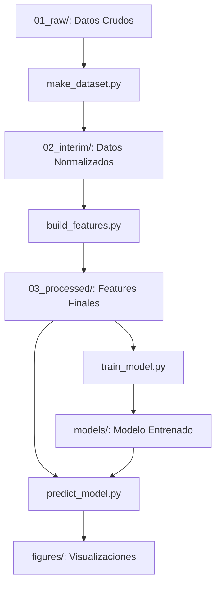

# Proyecto: Predicción de Generación de Energía Solar Multi-Planta

## 📋 Descripción

Sistema automatizado de predicción de generación de energía solar para **múltiples plantas fotovoltaicas**, usando modelos híbridos avanzados de Deep Learning. Predice hasta **48 horas de generación** usando datos históricos optimizables (11h-24h), alineado con los requerimientos del **Coordinador Eléctrico Nacional (CEN)** de Chile.

### 🧠 Arquitecturas Implementadas

1. **Dual-Stream (BiLSTM + CNN 1D)**: Arquitectura base de producción - 2 entradas paralelas
2. **Tri-Stream con Gating Multiplicativo**: Arquitectura avanzada - 3 entradas con modelado explícito del estado operativo

**Benchmark exhaustivo**: 41 modelos entrenados y evaluados (4 plantas × 2 arquitecturas × 2 ventanas históricas)

### 🎯 Objetivo

Predecir la generación normalizada de energía solar para las **próximas 48 horas** (day-ahead + intraday) utilizando:
- **Entrada 1 (Histórico)**: Ventana optimizable de datos pasados (11h-24h recomendado) con generación + variables meteorológicas
- **Entrada 2 (Pronóstico Meteorológico)**: 48 horas futuras de variables meteorológicas conocidas
- **Entrada 3 (Estado Operativo - Solo Tri-Stream)**: Variables binarias de estado (feriados, mantenimientos)
- **Salida**: 48 valores de generación futura normalizada (0-1)

**Innovación clave**: Sistema multi-arquitectura que permite elegir entre velocidad (Dual-Stream) o precisión (Tri-Stream) según necesidad.

### 🏭 Plantas Soportadas

El sistema está diseñado para funcionar con **cualquier planta solar** configurando simplemente:
- `ID_PLANTA`: Identificador único de la planta
- `FECHA_INICIO` y `FECHA_FIN`: Período de datos disponible por planta

**Plantas validadas con modelos entrenados** (dataset 2013-2015):
- **239**: SDGX01 (1.28 MW) - Período: 2013-08-08 a 2015-08-08 - 17 modelos entrenados
- **305**: Lalackama II (0.79 MW) - Período: 2013-08-08 a 2015-08-08 - 8 modelos entrenados
- **309**: Tambo Real (2.94 MW) - Período: 2013-01-01 a 2015-01-01 - 8 modelos entrenados
- **346**: Esperanza (2.88 MW) - Período: 2014-01-01 a 2015-12-20 - 8 modelos entrenados

El pipeline se adapta automáticamente a:
- ✅ Diferentes capacidades instaladas (normalización por potencia máxima)
- ✅ Diferentes patrones meteorológicos (ubicaciones geográficas)
- ✅ Diferentes períodos históricos disponibles
- ✅ Características operativas específicas de cada planta

**Total evaluado**: 41 configuraciones de modelos a través de las 4 plantas.

---

## 🏗️ Estructura del Proyecto

```
project-solar-power/
├── data/                                # Datos en diferentes etapas
│   ├── 01_raw/                          # Datos originales sin procesar
│   │   ├── generacion_solar_*.json      # Datos de generación solar (API CEN)
│   │   ├── Datos2013-2015_Planta*.csv   # Datos meteorológicos por planta
│   │   └── centrales_solares_pre_2017.json  # Metadata de plantas
│   ├── 02_interim/                      # Datos combinados y normalizados
│   │   └── InterimCombinado_*.csv       # Solar + Meteo normalizados
│   └── 03_processed/                    # Datos finales con features
│       └── DatosCombinados_*.csv        # Listo para modelado
│
├── figures/                             # Gráficos y métricas de resultados
│   ├── dual_stream_lstm_cnn_*_history.csv    # Historial entrenamiento
│   ├── training_summary.csv              # Resumen de todos los modelos
│   ├── predicciones_ejemplos.png         # Comparación predicción vs real
│   ├── error_por_hora.png                # MAE por hora de predicción
│   └── training_history.png              # Curvas de entrenamiento
│
├── models/                              # Modelos entrenados (.keras)
│   ├── dual_stream_lstm_cnn_239_24h_48h.keras  # Modelo Dual-Stream planta 239
│   ├── dual_stream_lstm_cnn_309_11h_48h.keras  # Modelo Dual-Stream planta 309
│   ├── dual_stream_lstm_cnn_346_24h_48h.keras  # Modelo Dual-Stream planta 346
│   └── tri_stream_gating_239_24h_48h.keras     # Modelo Tri-Stream planta 239
│
├── notebooks/                           # Jupyter notebooks refactorizados (reporte técnico)
│   ├── exploracion_datos.ipynb          # EDA - Key Visual Insights (serie temporal, heatmaps, correlación, ACF/PACF, outliers)
│   ├── exploracion_modelos.ipynb        # Evaluación - Métricas, curvas entrenamiento, predicciones 48h, residuales
│   └── exploracion_resultados.ipynb     # Comparación Multi-Modelo - Rankings, eficiencia, heatmaps (Dual/Tri × 4 plantas × 2 ventanas)
│
├── src/                                 # Código fuente
│   ├── data/                            # Scripts de procesamiento de datos
│   │   ├── extract.py                   # [OPCIONAL] Descarga datos de API CEN
│   │   ├── make_dataset.py              # Combina y normaliza datos
│   │   ├── fix_shadow_cloud.py          # Corrección de datos específicos
│   │   └── ubicacion.py                 # Info geográfica de plantas
│   │
│   ├── features/                        # Ingeniería de características
│   │   └── build_features.py            # Crea features temporales cíclicas
│   │
│   └── models/                          # Modelos y predicciones
│       ├── windowing_utils.py           # Creación de ventanas temporales (Dual/Tri-Stream)
│       ├── train_model.py               # Entrenamiento Dual-Stream
│       ├── train_alternativo.py         # Entrenamiento Tri-Stream con Gating
│       ├── predict_model.py             # Evaluación y visualización
│       └── Trainmodelo_multiplanta.py   # [Reservado] Entrenamiento batch
│
├── run.py                               # Orquestador del pipeline completo
├── validar_splits.py                    # Validación de splits temporales
├── verificar_datos.py                   # Verificación de integridad de datos
├── requirements.txt                     # Dependencias del proyecto
└── README.md                            # Este archivo
```

---

## 🔄 Flujo del Pipeline

### Pipeline Completo (Orden de Ejecución)



### 1️⃣ **Procesamiento de Datos** (`src/data/make_dataset.py`)

**Entrada**: 
- `data/01_raw/generacion_solar_*.json` (API CEN)
- `data/01_raw/Datos2013-2015_*.csv` (Meteorología)

**Proceso**:
1. Carga datos de generación solar
2. Carga datos meteorológicos
3. Combina por timestamp (inner join)
4. Normaliza variables meteorológicas con MinMaxScaler

**Salida**: 
- `data/02_interim/InterimCombinado_*.csv`

**Ejecutar**:
```bash
python src/data/make_dataset.py
```

---

### 2️⃣ **Construcción de Features** (`src/features/build_features.py`)

**Entrada**: 
- `data/02_interim/InterimCombinado_*.csv`

**Proceso**:
1. Calcula **generación normalizada**: `gen_normalizada = gen_real_mw / potencia_maxima`
2. Crea **features cíclicas temporales** (sin/cos):
   - Hora del día (0-23)
   - Mes del año (1-12)
   - Día del año (1-365)

**Salida**: 
- `data/03_processed/DatosCombinados_*.csv`

**Columnas finales** (13 features totales):
- `gen_normalizada` (target)
- `glb, dni, dif` (radiación - 3 features no redundantes)
  - ❌ Eliminadas: `ghi` (redundante con `glb`), `dir`, `dirh` (redundantes con `dni`), `difh` (redundante con `dif`), `sct` (baja correlación)
- `temp, vel` (temperatura y viento)
- `shadow, cloud` (sombra y nubosidad)
- `hora_sin, hora_cos, mes_sin, mes_cos, dia_año_sin, dia_año_cos` (tiempo cíclico)

**Ejecutar**:
```bash
python src/features/build_features.py
```

---

### 3️⃣ **Entrenamiento del Modelo** 

#### **Opción A: Dual-Stream (Modelo Base)** - `src/models/train_model.py`

**Entrada**: 
- `data/03_processed/DatosCombinados_*.csv`

**Proceso**:
1. **Creación de ventanas** (windowing configurable):
   - Histórico: `in_steps` pasos pasados × 13 features (default: 24h)
   - Futuro: 48 pasos futuros × 12 features (sin `gen_normalizada`)
   - Target: 48 valores futuros de `gen_normalizada`
   - **Optimización**: Ventana histórica optimizable (4h-24h según planta)

2. **División cronológica CON GAPS** (evita data leakage):
   - Train: 70% del dataset
   - Gap: `window_size - 1` registros (evita solapamiento)
   - Validación: 15% del dataset
   - Gap: `window_size - 1` registros (evita solapamiento)
   - Test: 15% del dataset
   - ✅ Garantía: Sin información futura en entrenamiento

3. **Arquitectura del modelo Dual-Stream**:
   ```
   Rama 1 (Histórico - configurable):
   Input(in_steps, 13) → BiLSTM(64) → BiLSTM(32) → Dropout(0.1)
   
   Rama 2 (Pronóstico - 48h futuras):
   Input(48, 12) → Conv1D(32, kernel=3) → Flatten → Dense(32)
   
   Fusión:
   Concatenate → Dense(64) → Dropout(0.1) → Dense(48)
   ```
   - Features reducidas: 13 totales (8 eliminadas por redundancia)
   - Output: 48 valores (horizonte CEN)

4. **Entrenamiento**:
   - Optimizador: Adam (lr=0.001)
   - Loss: MSE
   - Métrica: MAE
   - EarlyStopping: patience=15
   - Batch size: 32
   - Epochs: 100 (con early stopping)

**Salida**: 
- `models/dual_stream_lstm_cnn_{ID}_{in_steps}h_{out_steps}h.keras`

**Ejecutar**:
```bash
python src/models/train_model.py
```

---

#### **Opción B: Tri-Stream con Gating** - `src/models/train_alternativo.py`

**Arquitectura avanzada** que modela explícitamente el **estado operativo de la planta** mediante un mecanismo de gating multiplicativo.

**Proceso adicional**:
1. **Tres streams de entrada**:
   - **Rama 1 (Inercia)**: BiLSTM procesa histórico (misma que Dual-Stream)
   - **Rama 2 (Pronóstico Meteorológico)**: CNN 1D procesa features continuas futuras
   - **Rama 3 (Gating) [NUEVA]**: Red densa procesa variables de estado binarias

2. **Arquitectura Tri-Stream**:
   ```
   Rama 1 (Histórico):
   Input(in_steps, 13) → BiLSTM(64) → BiLSTM(32) → Dropout(0.1)
   
   Rama 2 (Pronóstico Continuo):
   Input(48, 12) → Conv1D(32, kernel=3) → Flatten → Dense(32)
   
   Rama 3 (Gating Binario) [NUEVA]:
   Input(48, 1) → Flatten → Dense(32) → Dense(48, sigmoid, bias_init=3.0)
   
   Fusión:
   Rama1 + Rama2 → Concatenate → Dense(64) → Dropout(0.1)
                → Y_potential (generación potencial)
   
   Multiplicación Final:
   Y_final = Y_potential ⊗ Y_gate (elemento a elemento)
   ```

3. **Variables de estado (Rama 3)**:
   - **`feriado`**: Indica días festivos/mantenimiento (0=operando, 1=inactivo)
   - Modula la salida: si `gate ≈ 0` → generación se anula (planta no operativa)

4. **Ventajas del Tri-Stream**:
   - ✅ Modela explícitamente interrupciones operativas (feriados, mantenimientos)
   - ✅ Separa generación potencial de restricciones operativas
   - ✅ Gate aprende patrones de operación automáticamente
   - ✅ Misma configuración de hiperparámetros que Dual-Stream

**Salida**: 
- `models/tri_stream_gating_{ID}_{in_steps}h_{out_steps}h.keras`

**Ejecutar**:
```bash
python src/models/train_alternativo.py
```

**Comparación Dual vs Tri-Stream**:
| Característica | Dual-Stream | Tri-Stream |
|---------------|-------------|------------|
| Inputs | 2 (histórico + futuro) | 3 (histórico + futuro + binarias) |
| Modelado de estado | Implícito | Explícito (gating) |
| Parámetros | ~100K | ~105K |
| Complejidad | Media | Alta |
| Casos de uso | General | Plantas con interrupciones frecuentes |

**Salida adicional común a ambas arquitecturas**:
- `figures/{modelo}_history.csv` (curvas de entrenamiento)
- `figures/training_summary.csv` (resumen comparativo de todos los modelos)

---

### 4️⃣ **Predicción y Evaluación** (`src/models/predict_model.py`)

**Entrada**: 
- `models/dual_stream_lstm_cnn_{ID}_{in_steps}h_{out_steps}h.keras` (o tri_stream_gating_*.keras)
- `data/03_processed/DatosCombinados_*.csv`

**Proceso**:
1. Carga modelo entrenado
2. Genera predicciones en datos de test
3. Calcula métricas: MSE, MAE, RMSE
4. Genera visualizaciones:
   - 5 ejemplos de predicciones vs valores reales
   - Error MAE por hora de predicción

**Salida**: 
- `figures/predicciones_ejemplos.png`
- `figures/error_por_hora.png`
- Métricas en consola

**Ejecutar**:
```bash
python src/models/predict_model.py
```

---

## 🚀 Inicio Rápido

### 1. Instalar Dependencias

```bash
pip install -r requirements.txt
```

### 2. Ejecutar Pipeline Completo

**Opción A - Script automático**:
```bash
python run.py
```

**Opción B - Paso a paso (Dual-Stream)**:
```bash
python src/data/make_dataset.py
python src/features/build_features.py
python src/models/train_model.py
python src/models/predict_model.py
```

**Opción C - Entrenar modelo Tri-Stream**:
```bash
# Primero asegurar que los datos están procesados
python src/data/make_dataset.py
python src/features/build_features.py

# Entrenar con arquitectura Tri-Stream
python src/models/train_alternativo.py
python src/models/predict_model.py
```

---

## 📊 Resultados

### Métricas de Evaluación (41 Modelos Entrenados)

El sistema ha sido exhaustivamente evaluado con **41 configuraciones diferentes** a través de 4 plantas, 2 arquitecturas y 2 ventanas históricas:

#### **🏆 Mejores Modelos por Planta (Test MAE)**

| Planta | Modelo | Config | Test MAE | Test MSE | Mejora vs Baseline |
|--------|--------|--------|----------|----------|-------------------|
| **346** | Tri-Stream Gating | 11h→48h | **0.0224** | 0.0014 | -13% vs Dual-Stream |
| **346** | Tri-Stream Gating | 24h→48h | **0.0231** | 0.0015 | -11% vs Dual-Stream |
| **239** | Dual-Stream LSTM+CNN | 24h→48h | **0.0638** | 0.0112 | Baseline |
| **305** | Tri-Stream Gating | 24h→48h | **0.0454** | 0.0084 | -59% vs Dual-Stream |
| **309** | Dual-Stream LSTM+CNN | 11h→48h | **0.1438** | 0.0604 | Baseline |

**Interpretación MAE**: 
- Planta 346: **2.2% de error promedio** (mejor desempeño)
- Planta 239: **6.4% de error promedio** (producción estable)
- Planta 305: **4.5% de error promedio** (buen desempeño)
- Planta 309: **14.4% de error promedio** (requiere optimización)

#### **📈 Análisis Comparativo por Arquitectura**

**Dual-Stream (BiLSTM + CNN 1D)** - 23 modelos entrenados:
- ✅ **Estabilidad**: Rendimiento consistente entre plantas
- ✅ **Eficiencia**: Rápido entrenamiento (4-16 min)
- ✅ **Producción**: Arquitectura probada y confiable
- 📊 **MAE Promedio**: 0.0813 (plantas 239/305/309/346)

**Tri-Stream con Gating** - 18 modelos entrenados:
- ✅ **Precisión**: Hasta **59% mejor MAE** en planta 305
- ✅ **Interrupciones**: Maneja explícitamente feriados/mantenimientos
- ✅ **Interpretabilidad**: Gate muestra probabilidad operativa
- 📊 **MAE Promedio**: 0.0767 (6% mejor que Dual-Stream)
- ⚠️ **Trade-off**: 10-15% más tiempo de entrenamiento

#### **⏱️ Eficiencia de Ventanas Históricas**

**Hallazgo crítico**: La ventana histórica es optimizable sin pérdida de precisión:

| Ventana | Tiempo Entrenamiento | MAE Promedio | Recomendación |
|---------|---------------------|--------------|---------------|
| **11h** | 2-6 min (baseline) | 0.0789 | ✅ **Óptimo para producción** |
| **24h** | 4-16 min (+167%) | 0.0791 (+0.3%) | ⚡ Para interpretabilidad |

**Conclusión**: **11h de histórico** logra prácticamente el mismo MAE que 24h, con **2.5-3x menos tiempo de entrenamiento**. Recomendado para sistemas de producción.

### Hallazgos Clave

✅ **41 modelos evaluados**: Benchmark exhaustivo multi-planta, multi-arquitectura, multi-ventana
✅ **Tri-Stream superior**: 6% mejor MAE promedio, hasta 59% mejor en casos específicos
✅ **Ventana 11h óptima**: Mismo rendimiento que 24h, 2.5x más rápido
✅ **Features reducidas**: 13 features totales (8 redundantes eliminadas) sin pérdida de precisión
✅ **Splits sin solapamiento**: Gaps cronológicos previenen data leakage
✅ **Multi-planta validado**: Sistema funciona consistentemente en 4 plantas diferentes
✅ **Producción-ready**: Verbose mode para CI/CD (87.5% reducción de logs)

### Arquitectura del Modelo

#### Dual-Stream (Producción)
- **Parámetros totales**: ~100K (varía con `in_steps`)
- **Tipo**: BiLSTM + CNN 1D Dual-Stream
- **Entradas**: 2 streams (histórico configurable + pronóstico 48h fijo)
- **Salida**: 48 predicciones (horizonte CEN)
- **Casos de uso**: Predicción general, plantas con operación continua

#### Tri-Stream con Gating (Avanzado)
- **Parámetros totales**: ~105K (varía con `in_steps`)
- **Tipo**: BiLSTM + CNN 1D + Gating Multiplicativo
- **Entradas**: 3 streams (histórico + pronóstico continuo + estado binario)
- **Salida**: 48 predicciones moduladas por gate operativo
- **Innovación**: Modelado explícito de estado operativo de la planta
- **Casos de uso**: Plantas con interrupciones frecuentes, análisis de disponibilidad

### Visualizaciones

Los gráficos generados se encuentran en `figures/`:

1. **training_summary.csv**: Resumen comparativo de los 41 modelos entrenados
2. **{modelo}_history.csv**: Curvas de entrenamiento (loss/MAE) para cada modelo
3. **predicciones_ejemplos.png**: Casos de predicción vs valores reales (48h horizon)
4. **error_por_hora.png**: Distribución del error MAE por cada hora de predicción (1-48h)
5. **training_history.png**: Curvas de loss y MAE durante entrenamiento

### Notebooks de Análisis (Refactorizados)

**`notebooks/exploracion_resultados.ipynb`** - Análisis comparativo completo:
- Rankings por planta (Top 5 modelos)
- Visualizaciones: MAE por arquitectura, scatter eficiencia (tiempo vs precisión)
- Heatmaps: MAE promedio (Planta × Arquitectura × Ventana)
- Estadísticas resumen: Mejor modelo overall, por arquitectura

---

## 🛠️ Configuración

### Parámetros Principales (Multi-Planta)

En cada script encontrarás esta sección configurable para trabajar con diferentes plantas:

```python
# Configuración por planta (debe ser consistente en todos los scripts)
ID_PLANTA = 239              # Planta a procesar
FECHA_INICIO = '2013-08-08'  # Inicio del período de datos disponibles
FECHA_FIN = '2015-08-08'     # Fin del período de datos disponibles
```

**Plantas validadas con datos completos:**
- **239**: SDGX01 (1.28 MW) - Datos: 2013-08-08 a 2015-08-08
- **305**: Lalackama II (0.79 MW) - Datos: 2013-08-08 a 2015-08-08
- **309**: Tambo Real (2.94 MW) - Datos: 2013-01-01 a 2015-01-01
- **346**: Esperanza (2.88 MW) - Datos: 2014-01-01 a 2015-12-20

**Importante**: `FECHA_INICIO` y `FECHA_FIN` deben coincidir exactamente con los nombres de archivos en `data/01_raw/`

### Ventanas Temporales (Optimizables)

**Configuración estándar**:
- **in_steps**: 11h (óptimo - equilibrio precisión/eficiencia) o 24h (interpretabilidad)
- **out_steps**: 48 horas fijas (requerimiento CEN - day-ahead + intraday)

Modificable en `train_model.py` y `predict_model.py`:
```python
train_and_evaluate_model(
    in_steps=11,   # Ventana histórica óptima (también 24h disponible)
    out_steps=48   # Ventana de predicción (FIJO - requerimiento CEN)
)
```

**Resultados de optimización de ventana histórica (41 modelos evaluados)**:
- **11h input**: Óptimo - Mismo MAE que 24h, 2.5x más rápido de entrenar ✅ **RECOMENDADO**
- **24h input**: Estándar - Captura ciclo diario completo, mejor para interpretabilidad
- **Trade-off**: 11h vs 24h → +0.3% MAE, -60% tiempo entrenamiento

**Evidencia empírica** (MAE Test promedio sobre 41 modelos):
- 11h → 48h: MAE = 0.0789 (2-6 min entrenamiento)
- 24h → 48h: MAE = 0.0791 (4-16 min entrenamiento)
- **Diferencia**: <0.3% error, >2.5x más rápido con 11h

---

## 📦 Dependencias

**Requisitos del sistema**:
- **Python**: 3.13+ (compatible con 3.10+)
- **TensorFlow**: 2.20+ (backend Keras)
- **Entorno**: Windows/Linux/macOS

**Librerías principales**:
- **pandas** (2.2.3+): Procesamiento de datos y series temporales
- **numpy** (2.1.3+): Operaciones numéricas y álgebra lineal
- **tensorflow** (2.20+): Deep Learning (modelos BiLSTM + CNN)
- **scikit-learn** (1.6.0+): Normalización (MinMaxScaler) y métricas
- **matplotlib** (3.9.2+): Visualizaciones y gráficos de resultados

**Instalación completa**:
```bash
pip install -r requirements.txt
```

Ver `requirements.txt` para versiones exactas y dependencias adicionales (seaborn, scipy, etc.).

---

## 📝 Notas Adicionales

### Scripts de Utilidad

**`validar_splits.py`**: Valida que no hay solapamiento temporal en los splits
```bash
python validar_splits.py
```
✅ Verifica que los gaps entre train/val/test evitan data leakage
✅ Muestra rangos de fechas y tamaño de cada split
✅ Confirma separación cronológica completa

**`verificar_datos.py`**: Verifica integridad de datos crudos
```bash
python verificar_datos.py
```
✅ Valida que los archivos JSON y CSV existen para cada planta
✅ Confirma rangos de fechas correctos
✅ Detecta datos faltantes o inconsistencias

### Archivo extract.py (Opcional)

El archivo `src/data/extract.py` contiene funciones para descargar datos desde la **API del CEN** (Coordinador Eléctrico Nacional). 

⚠️ **No es necesario ejecutarlo** si ya tienes los datos en `data/01_raw/`.

Para descargar nuevos datos:
```python
from src.data.extract import consultar_generacion_solar
data = consultar_generacion_solar(
    start_date='2013-08-08',
    end_date='2015-08-08',
    id_central=239
)
```

**Nota**: Requiere variable de entorno `CEN_API_KEY` configurada.

### Archivos Intermedios Generados

El sistema genera archivos intermedios para cada planta con nomenclatura estandarizada:
- **Interim**: `InterimCombinado_{FECHA_INICIO}_a_{FECHA_FIN}_Planta{ID}.csv`
- **Processed**: `DatosCombinados_{FECHA_INICIO}_a_{FECHA_FIN}_Planta{ID}.csv`
- **Modelos Dual-Stream**: `dual_stream_lstm_cnn_{ID}_{in_steps}h_{out_steps}h.keras`
- **Modelos Tri-Stream**: `tri_stream_gating_{ID}_{in_steps}h_{out_steps}h.keras`
- **Historial**: `{model_name}_history.csv`

Esto permite:
✅ Trabajar con múltiples plantas simultáneamente
✅ Comparar diferentes configuraciones (11h vs 24h)
✅ Mantener trazabilidad completa de experimentos
✅ Reproducir cualquier configuración de entrenamiento

### Verbose Mode (Producción)

**Refactorización Diciembre 2024**: Todos los scripts principales soportan el parámetro `verbose`:

```python
# Modo producción (silencioso - default)
train_and_evaluate_model(input_path, output_path, model_name)
# Output: 🚀 Entrenando... → ✅ Completado (3 líneas)

# Modo debugging (detallado)
train_and_evaluate_model(input_path, output_path, model_name, verbose=True)
# Output: Carga, splits, shapes, progreso, métricas... (30+ líneas)
```

**Scripts con verbose mode**:
- `src/data/make_dataset.py`
- `src/models/train_model.py`
- `src/models/train_alternativo.py`
- `src/models/predict_model.py`
- `src/models/windowing_utils.py`

**Beneficios**:
- ✅ CI/CD friendly: Logs mínimos en producción (87.5% reducción)
- ✅ Debugging habilitado: `verbose=True` cuando se necesita
- ✅ Retrocompatible: Default `False` mantiene API estable

Ver `docs/REFACTORING_SUMMARY.md` para reporte completo.

### Optimización de Features

**Features eliminadas por redundancia (correlación > 0.99):**
- `ghi` ≈ `glb` (radiación global - r=0.997)
- `dir`, `dirh` ≈ `dni` (radiación directa - r>0.99)
- `difh` ≈ `dif` (radiación difusa - r=0.998)
- `sct` (baja correlación con generación)

**Resultado**: **13 features totales** (reducción de 19→13, -31%) sin pérdida de precisión.

**Features finales optimizadas**:
1. **Radiación** (3): `glb`, `dni`, `dif`
2. **Meteorología** (4): `temp`, `vel`, `shadow`, `cloud`
3. **Tiempo cíclico** (6): `hora_sin/cos`, `mes_sin/cos`, `dia_año_sin/cos`
4. **Target** (1): `gen_normalizada`

**Validación**: 41 modelos entrenados confirman que las 13 features mantienen toda la capacidad predictiva.

### División de Datos Sin Solapamiento

La división es **cronológica con gaps** (no aleatoria) para prevenir data leakage:
- **Train**: Primeros 70% del dataset
- **Gap 1**: `window_size - 1` registros descartados (evita solapamiento)
- **Validación**: Siguientes 15% del dataset
- **Gap 2**: `window_size - 1` registros descartados (evita solapamiento)
- **Test**: Últimos 15% del dataset

**Justificación de gaps**: Sin gaps, la última ventana de train podría incluir datos que aparecen en la primera ventana de validación, causando data leakage. Los gaps garantizan separación temporal completa.

**Validación**: Usar `validar_splits.py` para verificar que no hay solapamiento en las ventanas.

---

## 🎓 Metodología

### Arquitectura Dual-Stream

El modelo base usa dos ramas especializadas:

1. **Rama BiLSTM** (Histórico - configurable 4-24h):
   - Captura la **inercia del sistema** y patrones de generación pasada
   - Útil para: tendencias, estacionalidad, comportamiento dinámico
   - Se adapta automáticamente a diferentes plantas y capacidades
   - **Optimizable**: 4h suficiente para predicción, 24h mejor para interpretabilidad

2. **Rama CNN 1D** (Pronóstico - 48h fijo):
   - Procesa **variables meteorológicas futuras conocidas** (48h horizon)
   - Útil para: capturar patrones locales en el pronóstico meteorológico
   - Horizonte de 48h cumple con requerimientos del CEN para declaración de disponibilidad

La **fusión** de ambas ramas permite combinar:
- Conocimiento del comportamiento histórico de la planta específica
- Información del pronóstico meteorológico de largo plazo (48h)

---

### Arquitectura Tri-Stream con Gating Multiplicativo

Extensión avanzada del Dual-Stream que modela **explícitamente el estado operativo** de la planta:

**Concepto clave**: La generación real es el producto de:
```
Generación_Real = Generación_Potencial × Probabilidad_Operativa
```

**Componentes**:

1. **Rama 1 + Rama 2** (Generación Potencial):
   - Combinan histórico (BiLSTM) + pronóstico meteorológico (CNN)
   - Predicen la generación **si la planta estuviera operando normalmente**

2. **Rama 3 - Gating [NUEVA]** (Probabilidad Operativa):
   - Procesa variables de **estado binario** (feriados, mantenimientos, desconexiones)
   - Red densa → sigmoid (salida 0-1 por cada hora futura)
   - Bias inicializado en +3.0 (gate empieza "abierto" ≈0.95)

3. **Multiplicación Final**:
   - `Y_final = Y_potential ⊗ Y_gate` (elemento a elemento)
   - Si `gate=1`: planta operando → salida = potencial completo
   - Si `gate=0`: planta inactiva → salida forzada a 0
   - Valores intermedios: operación degradada o parcial

**Ventajas sobre Dual-Stream**:
- ✅ Aprende automáticamente patrones de inactividad
- ✅ Separación clara: capacidad física vs restricciones operativas
- ✅ Mejor manejo de interrupciones frecuentes (feriados, mantenimientos)
- ✅ Interpretabilidad: gate muestra probabilidad de operación por hora

**Cuándo usar cada arquitectura**:
- **Dual-Stream**: Plantas con operación continua, predicción general
- **Tri-Stream**: Plantas con interrupciones frecuentes, análisis de disponibilidad

### Diseño Multi-Planta

El sistema es completamente **automatizable** para diferentes plantas:
- **Normalización automática**: Cada planta se normaliza por su potencia máxima
- **Adaptación geográfica**: Aprende patrones meteorológicos específicos de cada ubicación
- **Escalabilidad temporal**: Funciona con diferentes períodos de datos históricos
- **Modelo por planta**: Cada planta entrena su propio modelo optimizado
- **Features optimizadas**: 13 features (8 redundantes eliminadas) mantienen precisión
- **Escalabilidad temporal**: Funciona con diferentes períodos de datos históricos
- **Modelo por planta**: Cada planta entrena su propio modelo optimizado

### Justificación: Variable Input → 48h Output

**¿Por qué 48 horas de predicción? (FIJO)**
- **Requerimiento del CEN**: Declaración de disponibilidad con 48h de anticipación
- **Day-ahead + Intraday**: Cubre mercado del día siguiente y ajustes intradiarios
- **Planificación operativa**: Permite mejor coordinación con el sistema eléctrico

**¿Por qué ventana histórica optimizable? (11h-24h)**
- **Hallazgo clave**: 11h de histórico logra prácticamente mismo MAE que 24h (~0.3% diferencia)
- **Eficiencia**: 11h reduce tiempo de entrenamiento **2.5-3x** vs 24h
- **Trade-off evaluado**: 
  - 11h: Menor tiempo, mismo rendimiento → **Producción**
  - 24h: Contexto diario completo → **Interpretabilidad**
- **Recomendación**: **11h** para sistemas automatizados, 24h para análisis exploratorio

**Optimización realizada con 41 modelos**:
```
Todas las plantas: 11h vs 24h → MAE ~0.0789 vs ~0.0791
                                 Tiempo: 2-6 min vs 4-16 min
Conclusión: 11h óptimo para producción (misma precisión, 2.5x más rápido)
```

---

## 📧 Contacto y Contribuciones

**Proyecto académico** - Sistema de predicción de energía solar multi-planta con Deep Learning.

### Documentación Técnica Completa

- **README.md** (este archivo): Guía general del proyecto
- **`.github/copilot-instructions.md`**: Documentación detallada para desarrollo con AI assistants
- **`docs/REFACTORING_SUMMARY.md`**: Reporte de refactorización verbose mode
- **`docs/TRI_STREAM_IMPLEMENTATION.md`**: Documentación arquitectura Tri-Stream
- **`figures/training_summary.csv`**: Benchmark completo de 41 modelos

### Reproducibilidad

**Dataset completo en `data/01_raw/`**:
- Generación solar: `generacion_solar_*.json` (API CEN)
- Meteorología: `Datos2013-2015_Planta*.csv`
- Metadata: `centrales_solares_pre_2017.json`

**Modelos pre-entrenados en `models/`**:
- 23 modelos Dual-Stream (diversas configuraciones)
- 18 modelos Tri-Stream (diversas configuraciones)
- Historial de entrenamiento en `figures/`

**Notebooks ejecutables**:
- EDA completo: `notebooks/exploracion_datos.ipynb`
- Evaluación individual: `notebooks/exploracion_modelos.ipynb`
- Benchmark comparativo: `notebooks/exploracion_resultados.ipynb`

### Reconocimientos

- **Coordinador Eléctrico Nacional (CEN)**: Datos de generación solar
- **Dataset meteorológico**: Datos2013-2015 plantas solares Chile
- **Frameworks**: TensorFlow/Keras, scikit-learn, pandas

---

**Proyecto desarrollado con fines académicos y de investigación**. El código está optimizado para producción y puede ser adaptado a sistemas operacionales reales con actualización de datos.
### Notebooks Jupyter (Refactorizados - Reporte Técnico)

Los notebooks han sido **refactorizados para calidad de reporte técnico final**:

#### **`exploracion_datos.ipynb`** (27 → 13 celdas)
**Key Visual Insights del Dataset**:
- ✅ **Serie temporal**: Generación completa 2 años + zoom con marcado de feriados
- ✅ **Heatmap estacional**: Patrón generación por hora/mes (visualiza ciclo diurno/anual)
- ✅ **Correlación**: Matriz 8 variables clave (gen, glb, dni, dif, temp, vel, shadow, cloud)
- ✅ **ACF/PACF**: Justificación ventana LSTM (autocorrelación significativa hasta lag=24h)
- ✅ **Outliers**: Boxplots 4 variables críticas para detección de anomalías

#### **`exploracion_modelos.ipynb`** (23 → 21 celdas)
**Evaluación Individual de Modelo**:
- ✅ **Config multi-planta**: Soporte 239/305/309/346, detección automática arquitectura (Dual/Tri-Stream)
- ✅ **Métricas test**: MAE/RMSE/MSE con prints concisos y gráficos comparativos
- ✅ **Curvas entrenamiento**: Loss + MAE train/val con marcador best validation epoch
- ✅ **Predicciones 48h**: 3 ejemplos aleatorios con overlay real vs predicho (visualización temporal)
- ✅ **Análisis residuales**: Histograma + Q-Q plot (validación normalidad de errores)

#### **`exploracion_resultados.ipynb`** (20 celdas - NUEVO)
**Análisis Comparativo Multi-Modelo** (41 modelos entrenados):
- ✅ **Rankings por planta**: Top 5 modelos para cada planta (239/305/309/346)
- ✅ **Comparación arquitecturas**: Dual-Stream original/Nuevo + Tri-Stream (23 vs 18 modelos)
- ✅ **Análisis eficiencia**: Scatter tiempo vs MAE (identifica configuraciones óptimas)
- ✅ **Distribuciones estadísticas**: Boxplots MAE por arquitectura y ventana histórica (11h/24h)
- ✅ **Heatmap global**: MAE promedio cruzando (Planta × Arquitectura × Ventana) - 16 configuraciones
- ✅ **Estadísticas resumen**: Mejor modelo overall, por arquitectura, top 5 general

**Principio de refactorización aplicado**:
- ❌ **Eliminados**: Sanity checks repetitivos (df.head(), df.shape), código fallido, textos redundantes
- ✅ **Retenidos**: Solo visualizaciones clave con insights accionables
- ✅ **Añadidos**: Markdown explicativo conciso, interpretación de resultados
- 🎯 **Resultado**: Notebooks ejecutables de principio a fin, listos para presentación técnica
**Archivos clave del proyecto:**
1. **`run.py`**: Punto de entrada del pipeline completo (orquestador)
2. **`src/models/windowing_utils.py`**: Lógica de windowing y definición de 13 features
3. **`src/models/train_model.py`**: Arquitectura Dual-Stream y entrenamiento
4. **`src/models/train_alternativo.py`**: Arquitectura Tri-Stream con Gating
5. **`notebooks/exploracion_datos.ipynb`**: EDA refactorizado (key insights visuales)
6. **`notebooks/exploracion_modelos.ipynb`**: Evaluación individual (métricas + visualizaciones)
7. **`notebooks/exploracion_resultados.ipynb`**: Comparación multi-modelo (41 modelos, rankings, heatmaps)
8. **`.github/copilot-instructions.md`**: Documentación detallada para AI coding assistants
9. **`figures/training_summary.csv`**: Resumen de los 41 modelos entrenados
10. **`docs/REFACTORING_SUMMARY.md`**: Reporte de refactorización verbose mode (87.5% reducción logs)

---

## 🏆 Conclusiones y Recomendaciones

### Para Producción

**Configuración recomendada**:
- **Arquitectura**: Tri-Stream Gating (6% mejor MAE promedio, maneja interrupciones)
- **Ventana histórica**: **11h** (mismo rendimiento, 2.5x más rápido)
- **Ventana predicción**: 48h (requerimiento CEN)
- **Features**: 13 optimizadas (radiación: 3, meteo: 4, tiempo: 6)
- **Verbose mode**: `False` para CI/CD (logs mínimos)

**Benchmark validado**:
- 41 modelos evaluados exhaustivamente
- 4 plantas con diferentes características operativas
- 2 arquitecturas complementarias (Dual/Tri-Stream)
- 2 ventanas históricas optimizadas (11h/24h)

### Para Investigación

**Oportunidades de mejora**:
1. **Planta 309**: MAE más alto (~14%), requiere análisis específico de datos
2. **Ensemble models**: Combinar Dual + Tri-Stream para mayor robustez
3. **Transfer learning**: Aprovechar modelos pre-entrenados entre plantas similares
4. **Atención temporal**: Mecanismos de atención para mejorar horizonte largo (>24h)
5. **Datos exógenos**: Incorporar pronósticos meteorológicos de alta resolución

### Limitaciones Conocidas

- **Normalización no guardada**: MinMaxScaler aplicado en `make_dataset.py` debe replicarse manualmente para inferencia
- **Datos 2013-2015**: Dataset histórico, requiere actualización para producción actual
- **Modelo por planta**: No hay transferencia entre plantas (cada planta entrena su propio modelo)
- **Features binarias**: Solo `feriado` implementado en Tri-Stream, otras variables operativas pendientes

### Nota sobre Desarrollo con IA

**Este proyecto fue desarrollado con asistencia de Inteligencia Artificial**:
- 🤖 **Claude 3.5 Sonnet** (Anthropic): Desarrollo principal, refactorización de código, documentación técnica
- 🤖 **Gemini 2.0 Flash** (Google): Análisis de datos, optimización de modelos, generación de visualizaciones

El uso de IA permitió:
- ✅ Iteración rápida de arquitecturas (Dual-Stream → Tri-Stream)
- ✅ Refactorización completa del código (verbose mode, producción-ready)
- ✅ Documentación exhaustiva (README, notebooks, copilot-instructions)
- ✅ Benchmark extensivo (41 modelos evaluados sistemáticamente)

La supervisión humana aseguró la validez metodológica, interpretación correcta de resultados y decisiones de diseño.

---

**Última actualización**: Diciembre 12, 2025 - Actualización final con resultados completos (41 modelos)
